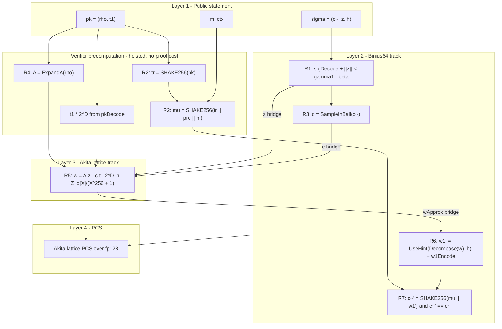

# Succinct N-Aggregate ML-DSA Verification — Design and Roadmap

This document is the canonical design + multi-phase roadmap for the
`binius-mldsa` crate. The goal is a single succinct proof that
**N independent ML-DSA-44 (Dilithium2 / FIPS 204) signatures all verify**.

It mirrors the architecture sketched in the four reference canvases that
live (locally) under
`~/.cursor/projects/Users-taghi-badakhshan-Projects-dilithium/canvases/`:
`mldsa-layer-architecture`, `mldsa-verification-relation`,
`dilithium-sign-flow`, `cross-pcs-evaluation-bridge`,
`matrix-expand-from-rho`. They are the source of truth for the layered
design; this document specialises them into a phased Binius64
implementation plan.

---

## 1. Problem statement

For a fixed parameter set (Phase 0–4 only target Dilithium2 / ML-DSA-44),
build an in-circuit relation
\[
R_{\text{agg}}\big((pk_i, m_i, \text{ctx}_i, \sigma_i)_{i=1}^{N}\big) = 1
\quad\Longleftrightarrow\quad
\bigwedge_{i=1}^{N}\,\text{ML-DSA.Verify}(pk_i, m_i, \text{ctx}_i, \sigma_i)
\]
producible as a single Binius64 (+ Akita-lattice) succinct proof. All
inputs are public.

Concrete success criteria:

- The single-signature verifier (`MlDsaVerifier`) compiles to a Binius64
  constraint system that accepts all KAT vectors from
  `dilithium/ref/nistkat` and rejects single-byte-tampered variants.
- The N-aggregate verifier (`AggregateMlDsaVerifier`) accepts a vector
  of `N ∈ {1, 4, 16, 64}` honest signatures and rejects if any one is
  tampered.
- Verifier wall-clock per signature scales as `O(1)` (independent of `N`)
  once Phase 5 folding lands; through Phase 4 the cost is `O(N)` from
  the flat composition.

---

## 2. Reference architecture (two-track)

The verification relation splits into seven sub-relations (R1–R7). R2
(`tr, μ`) and R4 (`A = ExpandA(ρ)`) are pure hashes of public inputs and
are hoisted to the verifier (no proof cost). The remaining five live in
two tracks:

The three horizontal **cross-field bridges** are:

- `z` (`L = 4` polynomials, each 256 coefficients in `Z_q`): Binius64 → Akita
- `c` (sparse polynomial, `τ = 39` non-zero `±1` coefficients): Binius64 → Akita
- `wApprox` (`K = 4` polynomials, each 256 coefficients in `Z_q`): Akita → Binius64

---

## 3. Sub-relation decomposition

| Sub-relation | Where | Proof system | Phase to land |
|---|---|---|---|
| R1 — sigDecode + `‖z‖ < γ₁ − β` (`L · 256 = 1024` range checks) | Binius64 | `verifier::range::z_norm_check` | Phase 1 |
| R2 — `tr = H(pk)`, `μ = H(tr ‖ pre ‖ m)` | hoisted | verifier-side `sha3` | (none) |
| R3 — `c = SampleInBall(c̃)` (Fisher–Yates over SHAKE256) | Binius64 | `verifier::sample_in_ball` | Phase 1 |
| R4 — `A = ExpandA(ρ)` (`K·L = 16` SHAKE128 streams) | hoisted | verifier-side `sha3` | (none) |
| R5 — `w = A·z − c·t₁·2^D` (`K·L + K = 20` ring multiplications) | Akita lattice | `lattice::ring_arith` | Phase 2 |
| R6 — `Decompose` + `UseHint` + `w1Encode` (`K · 256 = 1024` operations) | Binius64 | `verifier::hint::use_hint` | Phase 1 |
| R7 — `c̃' = SHAKE256(μ ‖ PackW1(w₁'))` and `c̃' == c̃` | Binius64 | `verifier::final_hash` | Phase 1 |

Per the canvas's cost analysis tab, R7's single SHAKE256 evaluation
dominates the in-circuit cost at 30–60 % of total constraints; replacing
SHAKE256 with an algebraic hash (Poseidon / Rescue) is a future
optimisation (Phase 6+), not in scope here.

---

## 4. Cross-field bridge

The bridge between Binius64 (binary tower over `BinaryField128bGhash`,
addition = XOR) and Akita (prime field `fp128`, addition = mod-p) is
the same algebraic problem as the Akita PCS bridge already solved in
`crates/akita-bridge/`: the lift is not a field homomorphism, so we
bit-decompose, commit the bit table over Akita, and reconnect via a
parity bridge + sumchecks.

### 4.1 Option A — public-output bridge (Phase 2 MVP)

Each of `z`, `c`, `wApprox` is exposed as a **public output** of both
the Binius64 sub-proof and the Akita sub-proof. The outer transcript
runs an equality check after the two sub-proofs verify
independently. Pros: trivial composition, no new soundness machinery.
Cons: (a) leaks the signature-derived intermediate values into the
transcript (acceptable here since all ML-DSA inputs are public), (b)
proof size grows linearly in the bridge data (`L · 256 + τ + K · 256
≈ 2.3 K coefficients in Z_q ≈ 7 KiB raw per signature`).

### 4.2 Option B — cross-field commitment (Phase 3)

Both sides commit to the bridge data — Binius64 commits the bit-slice
table, Akita commits the field-element form — and prove they commit to
the same values via a parity bridge + selected-bit sumcheck + Booleanity
sumcheck, exactly as in `crates/akita-bridge/src/protocol.rs`. The
machinery is already there for the witness oracle; Phase 3 generalises
it to arbitrary "shared" wires.

Once Phase 3 lands, the bridge becomes succinct: cost grows only
logarithmically in the bridge data size.

---

## 5. Aggregation

Three strategies are available per the canvas's Aggregation tab:

| Strategy | Per-step cost | Proof size | Streaming | When |
|---|---|---|---|---|
| Flat composition | `N · C` | `O(1)` | no | small `N` (≤ 16); Phase 4 MVP |
| Recursive SNARK (IVC) | `C + C_verifier` | `O(1)` | yes | medium `N`; later Phase 5 |
| Folding (Nova / Protogalaxy) | `C + C_fold` (≈ 1 MSM) | `O(1)` | yes | large `N`; production target, Phase 5 |

**Bridge sharing under aggregation**: the bridge transcript can be
shared across all `N` per-signature instances — the parity bridge and
both sumchecks can batch over the aggregate (concatenated) witness
oracle. This drops the bridge cost from `O(N · log B)` to `O(log(N·B))`
where `B` is the per-signature bridge size. Phase 4 implements this
sharing.

---

## 6. Phase plan

### Phase 0 — scaffolding (this PR)

- [x] New `binius-mldsa` crate at [`crates/mldsa/`](../crates/mldsa/).
- [x] Dilithium2 constants in [`crates/mldsa/src/params.rs`](../crates/mldsa/src/params.rs).
- [x] `Z_q` (Q = 8 380 417, 23-bit) field gadgets in
  [`crates/mldsa/src/zq.rs`](../crates/mldsa/src/zq.rs):
  `add`, `sub`, `mul`, `from_u64_witness` — proptest-validated against
  the native reference in [`crates/mldsa/tests/zq.rs`](../crates/mldsa/tests/zq.rs).
- [x] SHAKE256 wrapper in
  [`crates/mldsa/src/shake.rs`](../crates/mldsa/src/shake.rs), cross-validated
  against the `sha3` crate in
  [`crates/mldsa/tests/shake.rs`](../crates/mldsa/tests/shake.rs).
  Initial Phase 0 cut was a single-block-only `shake256_fixed`; Phase 1
  generalised it to multi-block absorb + cross-block squeeze + a
  `Shake256Sponge` cursor type whose multiple `squeeze` calls compose
  into the same byte stream a single long squeeze would produce
  (required by R3's Fisher-Yates rejection loop).
- [x] `MlDsaVerifier` and `AggregateMlDsaVerifier` `unimplemented!()`
  stubs whose tests are `#[ignore]`'d with phase pointers (see
  [`crates/mldsa/tests/verifier_smoke.rs`](../crates/mldsa/tests/verifier_smoke.rs)).
- [x] This design doc.

### Phase 1 — single-signature verifier, single-track

Goal: a working `MlDsaVerifier` that takes (`pk, sig, μ, c, A, t₁·2^D,
wApprox`) as public inputs (R5 hoisted to the verifier — it natively
runs `w = A·z − c·t₁·2^D` and feeds the result in) and proves R1 + R3
+ R6 + R7 in Binius64.

- R1: `sigDecode` (bit-packed `z` / `h` decoding) + `‖z‖ < γ₁ − β`
  (1024 range checks).
  - [x] `polyz_unpack_centered` (576-byte → 256-coefficient unpacker)
    and `assert_norm_centered` (`β < centered < 2γ₁ − β` per coefficient)
    in [`crates/mldsa/src/polyz.rs`](../crates/mldsa/src/polyz.rs); 14
    tests in [`crates/mldsa/tests/polyz.rs`](../crates/mldsa/tests/polyz.rs).
  - [x] `unpack_z` wrapper for the `L = 4` polynomials inside the full
    signature byte stream and `unpack_c_tilde` (trivial 32-byte slice)
    in [`crates/mldsa/src/sigdecode.rs`](../crates/mldsa/src/sigdecode.rs);
    7 tests in [`crates/mldsa/tests/sigdecode.rs`](../crates/mldsa/tests/sigdecode.rs)
    covering the round-trip, per-polynomial isolation, c̃-vs-z
    isolation, and the full sigdecode + norm-check accept / reject end
    to end.
  - [ ] `unpack_h` (variable-length hint encoding with rejection
    conditions; non-trivial since the C parser has data-dependent
    control flow — needs a multiplexer-based design).
- [ ] R3: `SampleInBall(c̃)` — runs `Shake256Sponge` (Phase 0/1
  generalised) seeded by `c̃`, emits a sparse polynomial with `τ = 39`
  `±1` non-zero coefficients via Fisher-Yates with rejection sampling.
  SHAKE streaming prerequisite is now in; only the Fisher-Yates loop
  (mux-based since the rejection rate is data-dependent) remains.
- R6: `Decompose` + `UseHint` + `w1Encode` over the 1024
  `wApprox` coefficients, using `zq` gadgets.
  - [x] `decompose` (single coefficient: `r ↦ (r1, r0_p)` with
    `r1 ∈ [0, 43]`, `r0_p ∈ [0, 2γ₂]`) and `use_hint` (single
    coefficient: `(r, h) ↦ w1'`) in
    [`crates/mldsa/src/rounding.rs`](../crates/mldsa/src/rounding.rs);
    15 in-circuit tests in
    [`crates/mldsa/tests/rounding.rs`](../crates/mldsa/tests/rounding.rs)
    cross-validated against an exact port of
    `dilithium/ref/rounding.c` (whose own validity is checked by an
    `--ignored` exhaustive 8 M-iteration sweep over all `r ∈ Z_q`).
    The in-circuit constraints accept any valid `(r1, r0_p)`
    decomposition; soundness against malicious non-canonical
    decompositions is via the R7 final-hash check (see module-doc
    sketch in `rounding.rs` and the
    `boundary_decompositions_yield_different_use_hint_outputs` test).
  - [x] `polyw1_pack` (`w1Encode` for one 256-coefficient polynomial:
    pack 4 × 6-bit coefficients per 3 bytes, 192 bytes total per poly)
    in [`crates/mldsa/src/polyw1.rs`](../crates/mldsa/src/polyw1.rs);
    7 in-circuit tests in
    [`crates/mldsa/tests/polyw1.rs`](../crates/mldsa/tests/polyw1.rs)
    cross-validated against the C reference, including a
    "one-set-at-each-lane-boundary" stress for the next-lane
    overflow contribution.
  - [x] `K = 4` polynomial wrapper (`use_hint_polyvec`,
    `pack_w1_polyvec`) — landed inside the R7 module, see below.
- [x] R7: `c̃' = SHAKE256(μ ‖ w₁')` + binding equality `c̃' == c̃` —
  full Mode 2 K = 4 implementation in
  [`crates/mldsa/src/r7.rs`](../crates/mldsa/src/r7.rs):
  `assert_r7(b, w_approx, hint, mu_lanes, c_tilde_lanes)` composes
  `use_hint_polyvec` + `pack_w1_polyvec` + `shake256(_, 832 B, 32 B)`
  + per-lane `assert_eq` against `c̃`. The 12-test soundness battery in
  [`crates/mldsa/tests/r7.rs`](../crates/mldsa/tests/r7.rs) covers:
  - **Acceptance**: honest random K=4 (multiple seeds), zero inputs,
    decompose-boundary inputs.
  - **Tamper rejection** for each of the four R7 inputs (`c̃`,
    `wApprox`, `hint`, `μ`), at both polyvec position `[0][0]` and
    deep interior positions (`[K−1][N−1]`, `[K/2][N/2]`).
  - **Hint-mechanism correctness**:
    `r7_accepts_w_approx_perturbed_within_hint_slack` documents that
    R7 *deliberately* accepts wApprox perturbations that don't change
    `use_hint(_, h)` — this is the whole point of ML-DSA hints, and a
    future bug that makes R7 over-strict would break this test.
  - **Range cascade**: `r7_rejects_hint_geq_2` confirms `use_hint`'s
    `hint < 2` range check actually triggers when wired in via R7.
- [x] **Phase 1 verifier integration milestone**:
  [`crates/mldsa/src/verifier.rs`](../crates/mldsa/src/verifier.rs)
  ships the real `MlDsaVerifier::new(b, sig, mu_lanes, w_approx)`
  that wires `unpack_c_tilde + unpack_z + assert_norm_centered +
  unpack_h + assert_r7` into one Phase 1 verifier circuit (R5
  hoisted as public-input `w_approx`; everything else derived from
  `σ`).   Soundness battery in
  [`crates/mldsa/tests/phase1_verifier.rs`](../crates/mldsa/tests/phase1_verifier.rs)
  (11 cases): random honest acceptance (multiple seeds), c̃-byte
  tamper, z out-of-norm tamper, μ / wApprox tamper, prover-supplied
  hint-witness tamper, σ's h-section byte tamper (caught by
  `unpack_h`), tamper at polyvec position `[0][0]` and at the deepest
  interior, plus the hint-slack-invariance acceptance test
  (perturbations that don't change `use_hint` output are deliberately
  accepted, mirroring the same property at the R7 layer).
  Synthetic-but-self-consistent: each test builds the signature byte
  stream from random `(z, hint, w_approx, μ)` via the native R7
  pipeline, packs the hint via `pack_h_native`, and so the
  in-circuit verifier sees a fully consistent `σ = (c̃, z, h_packed)`
  exactly as a real ML-DSA verifier would after R5 hoisting.
- [ ] Real-Dilithium-signature roundtrip: extend the harness to
  invoke an external `ml-dsa` Rust crate (or FFI to
  `dilithium/ref`) so the test inputs come from an actual KAT signer
  rather than the synthetic R7-derived c̃. Will catch any
  byte-encoding drift between our `pack_signature_native` and FIPS
  204 §5.1 wire format.
  - [x] `unpack_h` (variable-length hint encoding with rejection
    conditions) in [`crates/mldsa/src/hint.rs`](../crates/mldsa/src/hint.rs);
    15 in-circuit tests in
    [`crates/mldsa/tests/hint.rs`](../crates/mldsa/tests/hint.rs)
    covering all five FIPS 204 validity rules (offsets monotone /
    `≤ OMEGA`, indices strictly increasing within each polynomial,
    dead bytes zero, hint cardinality matches `k_{K-1}`, witness bits
    `< 2`) plus several acceptance distributions (zeros, one-per-poly,
    single-poly only, OMEGA-density, random seeded). With this in,
    `MlDsaVerifier::new` no longer takes a hoisted `hint` parameter
    — it's derived from `σ` internally.
- [ ] Bench prover / verifier per signature in
  `crates/mldsa/benches/single_signature.rs`.

Out-of-scope for Phase 1: the actual lattice computation; Akita;
aggregation.

### Phase 2 — bring R5 into the proof via Akita lattice + Option-A bridge

Goal: replace the "hoisted `wApprox`" hack with a real R5 sub-proof.

- [ ] Implement `lattice::ring_arith` that proves
  `w = A·z − c·t₁·2^D` in `Z_q[X]/(X²⁵⁶ + 1)` using the Akita PCS for
  the bit-table commitments to `z`, `c`, `wApprox`. This requires
  upstream `akita-prover` to expose lattice-ring arithmetic
  (currently it only does PCS); coordinate with the Akita
  maintainers.
- [ ] Wire up Option-A bridge (`z`, `c`, `wApprox` exposed as outer
  public outputs; outer transcript checks equality between the
  Binius64 and Akita sub-proofs).
- [ ] End-to-end smoke test: same KATs, both sub-proofs accept, and
  the bridge equality holds.

### Phase 3 — replace Option-A bridge with Option-B succinct bridge

Goal: drop the linear-in-bridge-data cost.

- [ ] Reuse the parity bridge / selected-bit sumcheck / Booleanity
  sumcheck primitives from
  [`crates/akita-bridge/src/protocol.rs`](../crates/akita-bridge/src/protocol.rs)
  to commit the bridge data once and prove cross-field equality.
- [ ] Replace the public-output equality check from Phase 2 with the
  succinct bridge proof.
- [ ] Bench: target ≤ 5 % overhead vs Phase 2 in-circuit, and a proof
  size that grows logarithmically (not linearly) in `L · K · N`.

### Phase 4 — N-aggregate via flat composition

Goal: working `AggregateMlDsaVerifier` for `N ∈ {1, 4, 16, 64}` of
Dilithium2 signatures, with shared bridge.

- [ ] Generalise `MlDsaVerifier::new` to take a `subcircuit` namespace
  so `N` instances live cleanly under `agg/sig0`, `agg/sig1`, … in the
  constraint graph.
- [ ] Share the cross-field bridge transcript across all `N`
  instances (single batched parity bridge + sumcheck over the
  aggregate witness oracle).
- [ ] Wire up `aggregate_mldsa_verifier_accepts_n_honest_signatures`
  for `N = 4`.
- [ ] Bench `(prove, verify, proof_size)` matrix against
  `N ∈ {1, 2, 4, 8, 16, 32, 64}` in
  `crates/mldsa/benches/aggregate.rs`.

### Phase 5 — folding-based aggregation (production target)

Goal: drop the per-step cost from `O(C)` to roughly one MSM.

- [ ] Pick a folding scheme compatible with Binius64's commitment
  layer (Nova-style with FRI, or Protogalaxy if a polynomial-commitment
  matching scheme exists; this is itself a research question).
- [ ] Implement an in-circuit verifier for the folding step.
- [ ] Stream-aggregate over arbitrary `N` with constant per-step cost.

### Phase 6+ — out-of-scope optimisations

- [ ] Modes 3 / 5 (ML-DSA-65 / -87) parameterisation. The current
  `Mode` enum is forward-compatible but nothing else in the crate
  currently keys off `Mode::Mode3` / `Mode5`.
- [ ] Replace SHAKE256 with an algebraic hash (Poseidon / Rescue) in a
  Dilithium variant tailored for proofs — would roughly halve circuit
  size per the canvas cost analysis.

---

## 7. Open research questions

The following items are genuinely undecided and are flagged so future
phases don't over-commit:

1. **Mod-Q reduction in `Z_q`**: Phase 0 uses a hinted `(quotient,
   remainder)` pattern. Barrett reduction with a precomputed inverse
   would also work and might be cheaper at scale; revisit during
   Phase 1 once R5 / R6 reveal the multiplication count.
2. **NTT representation in R5**: do we keep `z`, `c`, `wApprox` in
   coefficient form throughout, or do an in-circuit NTT once at the
   start of R5? The reference C implementation does an NTT-domain
   multiply; the right answer in-circuit depends on the cost of NTT
   butterflies vs naive polynomial multiplication via convolution.
3. **Folding scheme for Phase 5**: Nova-on-FRI (e.g. HyperNova) vs
   Protogalaxy vs nothing-yet. Tied to what the binius-iop / akita
   stack ergonomically supports for an in-circuit verifier.
4. **In-circuit verifier of the cross-field bridge for Phase 5**: if
   we recurse, the cross-field bridge proof itself needs to be
   in-circuit-verifiable, which is a non-trivial extension of the
   current akita-bridge.

---

## 8. References

- **Canvases (local, Cursor)**:
  - `~/.cursor/projects/Users-taghi-badakhshan-Projects-dilithium/canvases/mldsa-layer-architecture.canvas.tsx`
  - `~/.cursor/projects/Users-taghi-badakhshan-Projects-dilithium/canvases/mldsa-verification-relation.canvas.tsx`
  - `~/.cursor/projects/Users-taghi-badakhshan-Projects-dilithium/canvases/dilithium-sign-flow.canvas.tsx`
  - `~/.cursor/projects/Users-taghi-badakhshan-Projects-dilithium/canvases/cross-pcs-evaluation-bridge.canvas.tsx`
  - `~/.cursor/projects/Users-taghi-badakhshan-Projects-dilithium/canvases/matrix-expand-from-rho.canvas.tsx`
- **Specifications**:
  - [FIPS 204 — Module-Lattice-Based Digital Signature Standard](https://csrc.nist.gov/pubs/fips/204/final)
  - Reference C implementation:
    `/Users/taghi.badakhshan/Projects/dilithium/ref/`
- **Adjacent in this repository**:
  - [`docs/akita-bridge-design-and-benchmarks.md`](akita-bridge-design-and-benchmarks.md)
    — the lattice-PCS bridge that R5 will eventually ride.
  - [`crates/akita-bridge/src/protocol.rs`](../crates/akita-bridge/src/protocol.rs)
    — the parity-bridge / sumcheck primitives that Phase 3 reuses.
  - [`docs/latex-write-up/akita-bridge.tex`](latex-write-up/akita-bridge.tex)
    — formal protocol spec of the lattice-PCS bridge.
