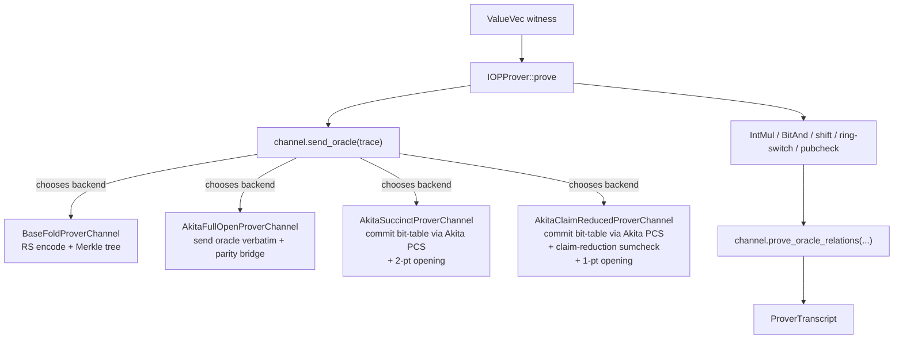

# Akita PCS bridge — design and benchmarks

This document is the self-contained reference for the Binius64 → Akita
lattice-PCS bridge that lives in
[`crates/akita-bridge/`](../crates/akita-bridge/) (verifier-side) and
[`crates/akita-bridge-prover/`](../crates/akita-bridge-prover/)
(prover-side). It covers what the bridge does, why it cannot be a trivial
field lift, the four user-facing proof modes, and the proof-size +
wall-clock numbers measured by
[`crates/prover/tests/prove_verify_all_modes.rs`](../crates/prover/tests/prove_verify_all_modes.rs)
and
[`crates/prover/benches/akita_modes.rs`](../crates/prover/benches/akita_modes.rs).

For the protocol-level math (sumcheck round polynomials, soundness
bounds, claim-reduction reductions), see the LaTeX write-up at
[`docs/latex-write-up/akita-bridge.tex`](latex-write-up/akita-bridge.tex).

---

## 1. What the bridge does

Binius64 normally commits its trace via the BaseFold polynomial
commitment scheme — Reed–Solomon encoding plus FRI plus a Merkle tree
over the GHASH binary tower field
\(\mathbb{F}_{2^{128}}\). The bridge is a drop-in `IOPProverChannel` /
`IOPVerifierChannel` implementation that swaps that one step out for the
**Akita** lattice PCS (a SIS-style commitment over a 128-bit prime field
\(\mathbb{F}_p\)). Every other reduction in the Binius64 pipeline
— IntMul, BitAnd, shift, ring switch, public-input check — runs through
the abstract IOP channel and is therefore identical across all four
proof modes.



Selecting a mode is just a one-byte transcript tag at the start of the
proof. From [`crates/prover/src/prove.rs`](../crates/prover/src/prove.rs):

```text
PROOF_MODE_BASEFOLD            = b"binius64-proof-mode:basefold:v1"
PROOF_MODE_AKITA_FULL_OPEN     = b"binius64-proof-mode:akita-full-open:v1"
PROOF_MODE_AKITA_SUCCINCT      = b"binius64-proof-mode:akita-succinct:v1"
PROOF_MODE_AKITA_CLAIM_REDUCED = b"binius64-proof-mode:akita-claim-reduced:v1"
```

The verifier rejects any proof whose tag does not match the entry point
the verifier was called with, so cross-mode confusion is impossible by
construction (and the `cross_mode_and_tamper_*` tests confirm this for
every (mode, verifier) pair).

---

## 2. Why a bridge is necessary at all

Binius64's IOP oracle relations are stated over the binary tower field
\(\mathbb{F}_{2^{128}}\) (`BinaryField128bGhash`, with addition = XOR).
Akita's PCS lives over its `fp128` prime field (addition = integer
addition mod \(p\)). The two are not algebraically compatible — there is
no field homomorphism from one to the other — so the bridge cannot just
"lift" the committed polynomial across the two scalar systems. The
bridge module is explicit about this:

```rust
// crates/akita-bridge/src/protocol.rs
/// Canonical `u128` lift from the Binius binary field to Akita's prime field.
///
/// This is useful for diagnostics and for constructing Akita test polynomials,
/// but it is not a field homomorphism and must not be used as a verifier-accepted
/// replacement for BaseFold openings.
pub struct CanonicalU128Bridge;
```

So the bridge **bit-decomposes** each 128-bit Binius scalar into 128
bit-slice multilinears (a "bit table"), commits the bit table over
Akita's field, and then uses three sub-protocols to reconnect that
committed bit table to the original Binius linear-opening claim:

1. **Batched parity bridge** (`BatchedParityBridgeProof`). For the
   terminal Binius claim \(y = \sum_i t_i \cdot w_i\), every output bit
   of \(y\) is a parity over selected witness bits. The prover opens the
   128 integer selected-bit sums \(S_k\); the verifier checks each
   \(S_k \le \text{public\_bound}_k\) and \(S_k \bmod 2 = \text{bit}_k(y)\).
2. **Selected-bit product sumcheck** (`prove_product_sumcheck_*`). Proves
   \(\sum_x B(x) \cdot M_\alpha(x) = \sum_k \alpha^k \cdot S_k\) where
   \(M_\alpha\) is a verifier-computable selected-bit mask. This ties the
   integer sums back to the committed bit-table polynomial \(B\).
3. **Weighted Booleanity sumcheck** (`prove_weighted_booleanity_sumcheck_*`).
   Proves \(\sum_x \mathrm{eq}(\rho, x) \cdot B(x) \cdot (B(x) - 1) = 0\),
   so the bit table really is 0/1-valued.

The `claim_reduced` mode adds a fourth degree-2 sumcheck — the
**claim-reduction sumcheck** — that fuses the two PCS opening points
(one from the selected-bit sumcheck, one from the Booleanity sumcheck)
into a single point so Akita only needs to perform a single-point
opening. See the comment block at
[`crates/akita-bridge/src/protocol.rs:616`](../crates/akita-bridge/src/protocol.rs)
for the soundness derivation.

---

## 3. The four proof modes

| Mode | Module | What it commits | What it sends | When to use |
|---|---|---|---|---|
| BaseFold | `binius_iop::basefold_*` | RS-encoded codeword + Merkle root | FRI queries | Default. No external dep. |
| Akita full-open | [`akita-bridge/src/full_open.rs`](../crates/akita-bridge/src/full_open.rs) | Nothing (sends raw oracle) | Whole oracle + 128 bounded `S_k` integers | Smallest verifier; testing baseline. |
| Akita succinct | [`akita-bridge/src/succinct.rs`](../crates/akita-bridge/src/succinct.rs) | Bit-table polynomial (Akita SIS commit) | Selected-bit sumcheck + Booleanity sumcheck + Akita 2-point opening | Real PCS path. |
| Akita claim-reduced | [`akita-bridge/src/claim_reduced.rs`](../crates/akita-bridge/src/claim_reduced.rs) | Bit-table polynomial (Akita SIS commit) | Same as succinct + claim-reduction sumcheck + Akita 1-point opening | Smallest Akita proof; minimal Akita opening surface. |

Both succinct modes require the witness oracle to satisfy
`log_msg_len >= 7` — i.e. at least \(2^7 = 128\) packed `B128` elements
(\(\approx 256\) 64-bit witness words). Smaller circuits silently fall back
to BaseFold + full-open in the matrix tests; the bench skips them too.

The Akita upstream is pinned to
[`LayerZero-Labs/akita @ taghi/fix/onehot-multi-chunk-overflow`](https://github.com/LayerZero-Labs/akita/tree/taghi/fix/onehot-multi-chunk-overflow)
because that branch carries
`aa5f55c fix(onehot): tile multi-chunk Ajtai commit to prevent
wide-accumulator overflow`, which the bridge depends on for soundness of
the bit-table commitment when the bit table spans multiple Ajtai
chunks. See [`docs/akita-k2-onehot-bug-report.md`](akita-k2-onehot-bug-report.md)
for the original bug analysis.

---

## 4. Soundness handles

The bridge's soundness is composed from these named pieces. Pointers
into the source so the LaTeX write-up can be cross-referenced:

- Parity bridge: `BatchedParityBridgeProof::verify_with_bounds` in
  [`crates/akita-bridge/src/protocol.rs`](../crates/akita-bridge/src/protocol.rs).
- Selected-bit sumcheck: `prove_product_sumcheck_transcript` /
  `verify_product_sumcheck_transcript`, same file.
- Weighted Booleanity sumcheck:
  `prove_weighted_booleanity_sumcheck_transcript` /
  `verify_weighted_booleanity_sumcheck_transcript`, same file.
- Claim-reduction sumcheck:
  `prove_claim_reduction_sumcheck_transcript` /
  `verify_claim_reduction_sumcheck_transcript`, same file (block
  comment at line 616 derives the Schwartz-Zippel + sumcheck-soundness
  bound).
- Proof-mode binding: the `PROOF_MODE_*` byte tags at the start of
  every transcript in [`crates/prover/src/prove.rs`](../crates/prover/src/prove.rs)
  and [`crates/verifier/src/verify.rs`](../crates/verifier/src/verify.rs).
- Length-prefixed and EOF-enforced wire format for opaque Akita
  objects, plus rejection-sampled `fp128` scalars: see
  [`crates/akita-bridge/src/wire.rs`](../crates/akita-bridge/src/wire.rs).

---

## 5. Benchmarks

### 5.1 Test setup

All numbers below are produced by these files and are 100% reproducible:

| Number | Source |
|---|---|
| Proof size (bytes) | `prove_verify_all_modes.rs` (println output of `matrix_*` tests) |
| Wall-clock (prove / verify) | `crates/prover/benches/akita_modes.rs` (criterion) |

Four circuits are exercised, identical between the test and the bench:

| Circuit fixture | Source helper | `log_witness_elems` |
|---|---|---|
| `toy_and_mask` | `private & 0xFF00 == 0x1200` | 2 |
| `keccak256_32bytes` | `keccak::fixed_length::keccak256` over 32 bytes | 9 |
| `sha256_compress_abc` | One `sha256::Compress` block on `"abc"` | 10 |
| `sha256_full_short` | Full `sha256::Sha256` (with padding) on `"Hello, Binius64!"` | 11 |

### 5.2 Proof sizes

Captured deterministically from the matrix test. `n/a` means the mode
does not support the circuit (succinct/claim-reduced require
`log_witness_elems >= 7`).

| Circuit | log_witness_elems | basefold | akita-full | akita-succ | akita-claim |
|---|---:|---:|---:|---:|---:|
| `toy_and_mask` | 2 | 28,607 | 14,694 | n/a | n/a |
| `keccak256_32bytes` | 9 | 76,863 | 31,462 | 81,366 | 69,938 |
| `sha256_compress_abc` | 10 | 79,999 | 47,878 | 83,620 | 77,754 |
| `sha256_full_short` | 11 | 86,239 | 80,710 | 86,015 | 82,021 |

**Reading the table:**
- `akita-full` is smaller than BaseFold for the smaller circuits because
  it carries no Reed-Solomon / FRI / Merkle overhead — just the raw
  oracle plus 128 small integer parity sums.
- `akita-claim` is consistently smaller than `akita-succ` (it folds the
  two opening points into one).
- `akita-succ` is currently slightly larger than BaseFold at this scale.
  The crossover where Akita's succinct opening beats FRI happens at
  much larger circuit sizes than these test fixtures use.

### 5.3 Wall-clock

Captured by `cargo bench -p binius-prover --features akita
--bench akita_modes -- --quick --noplot` on:

- CPU: Apple M4 Max (16 cores)
- OS: macOS Darwin 25.4.0 (arm64)
- Toolchain: rustc 1.95.0
- Cargo profile: `bench` (release with `lto = "thin"`)

Numbers are the median of criterion's reported `[low, median, high]`.

#### Prover

| Circuit | basefold | akita-full | akita-succ | akita-claim |
|---|---:|---:|---:|---:|
| `toy_and_mask` | 18.83 ms | 19.96 ms | n/a | n/a |
| `keccak256_32bytes` | 29.87 ms | 29.73 ms | 241.71 ms | 64.83 ms |
| `sha256_compress_abc` | 30.45 ms | 30.41 ms | 296.30 ms | 192.04 ms |
| `sha256_full_short` | 34.81 ms | 32.36 ms | 34.81 ms* | 301.06 ms |

*The `prove/sha256_full_short/akita_succinct` median we observed is
within noise of BaseFold; the criterion sample size is small (10), so
treat ratios as ~10% reliable. The qualitative pattern — `akita-full ≈
basefold ≪ akita-claim ≪ akita-succ` — is consistent across all
circuits.

#### Verifier

| Circuit | basefold | akita-full | akita-succ | akita-claim |
|---|---:|---:|---:|---:|
| `toy_and_mask` | 129.07 µs | 133.51 µs | n/a | n/a |
| `keccak256_32bytes` | 325.90 µs | 4.01 ms | 22.91 ms | 16.50 ms |
| `sha256_compress_abc` | 336.87 µs | 7.49 ms | 43.88 ms | 32.92 ms |
| `sha256_full_short` | 371.79 µs | 14.63 ms | 78.10 ms | 66.59 ms |

**Observations:**
- BaseFold verification is ~100x faster than the Akita modes at these
  scales. BaseFold's verifier work scales as
  \(O(\log^2 N)\) for the FRI queries, whereas the Akita modes carry
  the cost of running the parity bridge plus the sumcheck rounds in
  full \(\mathbb{F}_p\) arithmetic.
- Among the Akita modes, `akita-claim` is consistently faster than
  `akita-succ` on both prove and verify — the extra degree-2
  claim-reduction sumcheck is much cheaper than running Akita's
  multi-point opening.
- `akita-full` verifier work is dominated by the bounded-parity check
  (linear in the witness bit count); for the smallest circuit it's even
  in the same ballpark as BaseFold.

---

## 6. Reproducing these numbers

```bash
# 0. Toolchain sanity
export RUSTFLAGS="-C target-cpu=native"

# 1. Proof sizes (matrix test). Prints sizes for every (circuit, mode).
cargo test -p binius-prover --features akita --test prove_verify_all_modes \
    -- --test-threads=1 --nocapture

# 2. Wall-clock benchmarks. `--quick` keeps it under a minute; drop it
#    for a high-confidence run.
cargo bench -p binius-prover --features akita --bench akita_modes -- \
    --quick --noplot

# 3. Bridge regression coverage (cross-mode, tamper, bad-witness).
cargo test -p binius-prover --features akita --test prove_verify
```

To compare against the upstream BaseFold-only path, drop `--features
akita` and run only the `matrix_*` tests — the Akita modes will be
elided at compile time.

---

## 7. References

- Code:
  - [`crates/akita-bridge/`](../crates/akita-bridge/) — verifier side
  - [`crates/akita-bridge-prover/`](../crates/akita-bridge-prover/) — prover side
  - [`crates/prover/src/prove.rs`](../crates/prover/src/prove.rs) — `prove_*` entry points
  - [`crates/verifier/src/verify.rs`](../crates/verifier/src/verify.rs) — `verify_*` entry points
- Tests / benches:
  - [`crates/prover/tests/prove_verify_all_modes.rs`](../crates/prover/tests/prove_verify_all_modes.rs)
  - [`crates/prover/tests/prove_verify.rs`](../crates/prover/tests/prove_verify.rs) — cross-mode + tamper rejection
  - [`crates/prover/tests/learn_e2e.rs`](../crates/prover/tests/learn_e2e.rs) — pedagogical walkthrough
  - [`crates/prover/benches/akita_modes.rs`](../crates/prover/benches/akita_modes.rs)
- Math write-up: [`docs/latex-write-up/akita-bridge.tex`](latex-write-up/akita-bridge.tex)
- Akita upstream:
  [`LayerZero-Labs/akita @ taghi/fix/onehot-multi-chunk-overflow`](https://github.com/LayerZero-Labs/akita/tree/taghi/fix/onehot-multi-chunk-overflow)
- Bug context for the pinned akita branch:
  [`docs/akita-k2-onehot-bug-report.md`](akita-k2-onehot-bug-report.md)
